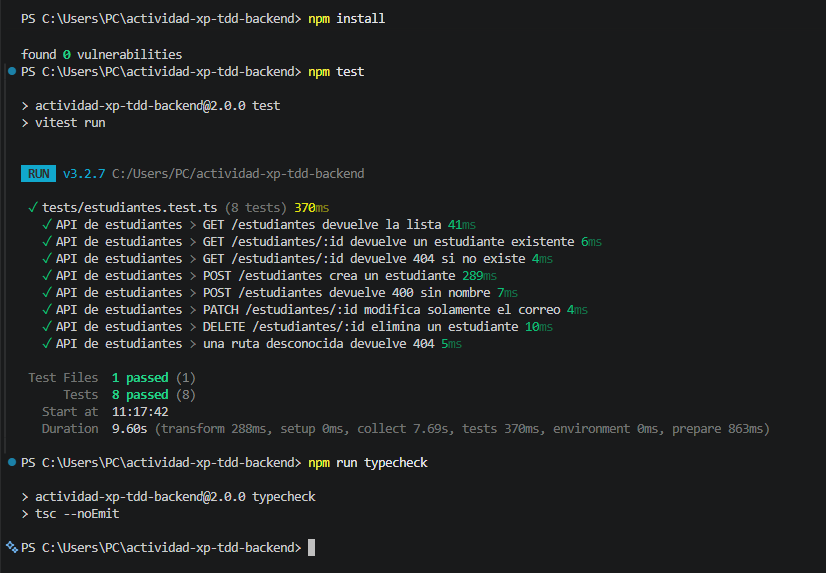

# Actividad Backend 31-08 — Evolución XP + TDD

Esta rama continúa la actividad anterior de backend. En lugar de crear un proyecto nuevo, se tomó como base el servidor HTTP desarrollado con TDD y se lo **reestructuró** para incorporar una API de estudiantes con una organización más clara.

## Objetivo

Evolucionar el backend anterior aplicando prácticas de Programación Extrema: 

- desarrollo incremental;
- pruebas automatizadas;
- feedback rápido;
- refactorización;
- diseño simple;
- historias de usuario y criterios de aceptación.

La actividad implementa las operaciones HTTP propuestas para estudiantes:

| Método | Ruta | Resultado principal |
|---|---|---|
| `GET` | `/estudiantes` | Lista de estudiantes |
| `GET` | `/estudiantes/:id` | Consulta un estudiante |
| `POST` | `/estudiantes` | Crea un estudiante |
| `PATCH` | `/estudiantes/:id` | Modifica únicamente el correo |
| `DELETE` | `/estudiantes/:id` | Elimina un estudiante |

También se mantienen los endpoints desarrollados anteriormente:

- `GET /salud`
- `GET /hora`

## Evolución respecto de la actividad anterior

La actividad anterior utilizaba directamente el módulo HTTP de Node.js y estaba concentrada en un archivo principal.

En esta iteración se realizó una refactorización estructural:

```text
src/
├── app.ts
├── server.ts
└── estudiantes/
    ├── estudiante.ts
    ├── estudiantes.repository.ts
    ├── estudiantes.service.ts
    ├── estudiantes.controller.ts
    └── estudiantes.routes.ts

tests/
└── estudiantes.test.ts

features/
└── estudiantes.feature
```

La separación tiene una responsabilidad simple:

- **routes**: define método y ruta;
- **controller**: interpreta la solicitud HTTP y construye la respuesta;
- **service**: concentra las operaciones del caso de uso;
- **repository**: administra los datos simulados en memoria;
- **tests**: comprueba el comportamiento de los endpoints;
- **features**: expresa criterios de aceptación en formato Gherkin.

No se agregó una base de datos porque para esta etapa los datos simulados permiten concentrarse en HTTP, arquitectura y pruebas.

## Stack

- TypeScript
- Node.js
- Express
- Vitest
- Supertest
- Gherkin para especificación de escenarios

## Historias de usuario

### Consultar estudiantes

> Como usuario de la API quiero consultar los estudiantes registrados para visualizar la información disponible.

Criterio principal:

```http
GET /estudiantes
200 OK
```

### Consultar un estudiante

> Como usuario quiero consultar un estudiante por identificador para obtener sus datos.

- existente: `200 OK`
- inexistente: `404 Not Found`

### Crear un estudiante

> Como usuario quiero registrar un estudiante para incorporarlo al sistema.

```http
POST /estudiantes
201 Created
```

### Modificar el correo

> Como usuario quiero modificar solamente el correo de un estudiante para mantener actualizado ese dato.

Se utiliza `PATCH` porque se modifica parcialmente el recurso.

### Eliminar un estudiante

> Como usuario quiero eliminar un estudiante para quitarlo del sistema.

```http
DELETE /estudiantes/:id
204 No Content
```

## Pruebas

La suite cubre los comportamientos principales:

1. listar estudiantes;
2. consultar un estudiante existente;
3. responder `404` cuando no existe;
4. crear un estudiante;
5. rechazar una creación sin nombre;
6. modificar únicamente el correo;
7. eliminar y comprobar la eliminación;
8. responder `404` para rutas desconocidas.

## XP y TDD

El trabajo conserva la idea aplicada en la actividad anterior:

```text
Historia / criterio
       ↓
Prueba
       ↓
RED 🔴
       ↓
Código mínimo
       ↓
GREEN 🟢
       ↓
Refactor 🔵
       ↓
Siguiente historia
```

La nueva estructura es una refactorización del backend, no un proyecto independiente. De esta forma el repositorio muestra la evolución incremental entre actividades.

## Especificación BDD

En `features/estudiantes.feature` se documentan los escenarios principales con sintaxis Gherkin:

```gherkin
Escenario: Crear un estudiante
  Cuando envío una solicitud POST a "/estudiantes" con nombre y correo válidos
  Entonces el código de respuesta debe ser 201
```

Los escenarios funcionan como criterios de aceptación legibles y la suite automatizada de `tests/estudiantes.test.ts` verifica técnicamente esos comportamientos.

## Instalación y ejecución

Instalar dependencias:

```bash
npm install
```

Ejecutar pruebas:

```bash
npm test
```

Comprobar TypeScript:

```bash
npm run typecheck
```

Levantar el servidor:

```bash
npm run dev
```

Servidor:

```text
http://localhost:3000
```

## Ejemplos rápidos

Consultar estudiantes:

```bash
curl http://localhost:3000/estudiantes
```

Crear:

```bash
curl -X POST http://localhost:3000/estudiantes \
  -H "Content-Type: application/json" \
  -d '{"nombre":"Lucía","correo":"lucia@universidad.edu"}'
```

Modificar correo:

```bash
curl -X PATCH http://localhost:3000/estudiantes/1 \
  -H "Content-Type: application/json" \
  -d '{"correo":"ana.nuevo@universidad.edu"}'
```
## Evidencia de ejecución

### Pruebas automatizadas y validación de tipos



Resultado:
- 8 pruebas aprobadas
- 0 pruebas fallidas
- TypeScript sin errores
  
## Conclusión

La actividad muestra la evolución del backend inicial hacia una estructura más organizada, manteniendo la idea central de XP: realizar cambios pequeños, verificables y guiados por pruebas. Los endpoints HTTP, los códigos de estado, la separación de responsabilidades y los criterios de aceptación quedan documentados en el mismo repositorio.
